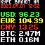

# Pixoo news feed

> Формирует анимированный GIF для Pixoo 64 (квадратный анимированный 64 x 64). Выводит туда актуальный курс валют и последние новости из RSS (из открытого канала Telegram). Циклично меняет и закидывает на устройство.

## Настройка

* Закидываем на хостинг (можно и на локальный, но надо чтобы на хостинге был LAMP (PHP 7 и выше + библиотека GD с поддержкой TTF)) содержимое папки ./web. Пробуем открыть удалённо в браузере https://ваш_адрес/rss_pic.php и если видим квадратную GIF, то всё в порадке, а если нет - смотрим в логи и исправляем ошибки (хотя их быть не должно).
* Настраиваем Pixoo 64 так, чтобы он был включён, находился в одной локальной сети и т.д. Словом, всё чтобы у нас работало REST API из репозитория https://github.com/4ch1m/pixoo-rest. По итогу где-то на локальном компьютере или Raspberry PI или ещё где должно открываться http://localhost:5000/
* На этом же или на другом компьютере / Raspberry PI или не сильно важно где, но главное чтобы был доступ к этому REST API копируем в отдельную папку файлы из ./local и запускаем в фоне ./news.php, например так: "php ./news.php". Этот скрипт обращается к Pixoo через REST API и меняет GIF, которая рендерится предыдущим скриптом. Если всё хорошо, то на вашем Pixoo 64 будет крутиться курс валют и последние новости.

Настройки самих новостей, курсов валют, цветов, шрифтов - в файле ./web/rss_pic.php. Сейчас новости берутся из TG-канала Mash а курсы через coingate.

## License

Лицензия на код прокта в файле [LICENSE](LICENSE).

Шрифты взяты из открытых источников с сайта https://fonts-online.ru/ и права на них принадлежат их авторам на основании соответствующих лицензий.
* Retro Land Mayhem - Copyright Dayton2949 2021, FontStruct Non-Commercial License
* Pixel Cyr - Copyright (c) Swamp Design & Dubina Nikolay, 2002. All rights reserved.

В проекте использованы открытые библиотеки:
* https://github.com/lunakid/AnimGif
* https://github.com/4ch1m/pixoo-rest
